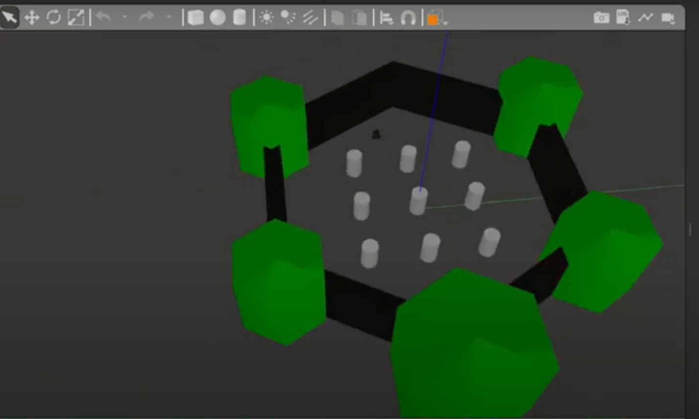
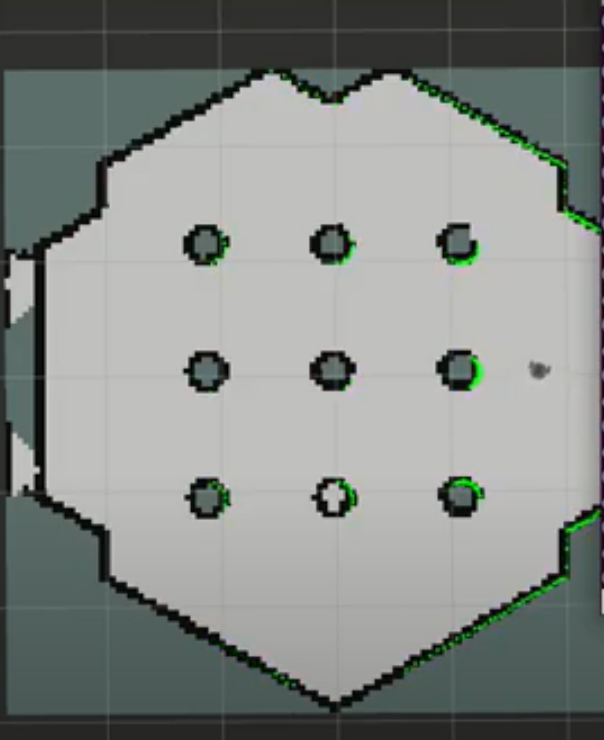

<h1> Create Robot Navigation using SLAM</h1>

 TurtleBot3 is a platform robot of ROS. I should install it on ROS Melodic. TurtleBot3 runs SLAM technology to build and save a map in the physical environment. It continuously acquires the data from the real world in the form of dots and feeds it into machines to make them percept and grasp the surrounded environment. It can be utilized in various technologies such as AI, games, robotics and Augmented Reality (AR) to provide an immersive and interactive experience. Using SLAM technique, can recognize and avoid obstacles like objects and walls in the real world.

<h2> Installing TurtleBot3 Package for ROS Melodic.</h2>

 Access to src directory to downloud and install the important Turtlebot3 packages on ROS Melodic.

<pre><code>cd ~/catkin_ws/src
git clone https://github.com/ROBOTIS-GIT/turtlebot3.git
git clone https://github.com/ROBOTIS-GIT/turtlebot3_msgs.git
git clone https://github.com/ROBOTIS-GIT/turtlebot3_simulations.git
git clone https://github.com/ROBOTIS-GIT/turtlebot3_autorace.git</code></pre>

 To install package dependency, run:

<pre><code>rosdep install --from-paths src -i -y
source ~/catkin_ws/devel/setup.bash</code></pre>

 To speed up the running process and prevent the latency of crawling through the packages in ROS_ROOT, run:

<pre><code>rospack profile</code></pre>

 We use one type of Turtlebot3 models either burger or waffle, then we run bashrc which is shell script to run automatically

 when a user opens a new shell

<pre><code>echo "export TURTLEBOT3_MODEL=burger" >> ~/.bashrc
source ~/.bashrc </code></pre>

<h2> Unknown Navigation of Turtlebot3 in Gazebo World.</h2>

 After setting up the  Turtlebot3 environment correctly, Gazebo simulator should be opened with small robotic inside it.

 Type, the following command:

<pre><code>roslaunch turtlebot3_gazebo turtlebot3_world.launch</code></pre>

 Run the SLAM RViz.

<pre><code>roslaunch turtlebot3_slam turtlebot3_slam.launch slam_methods:=karto</code></pre>

